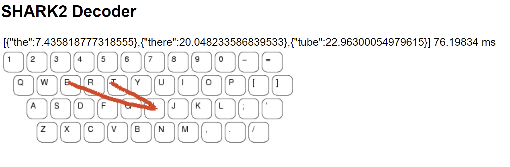

# Gesture Detection
We are recognizing swipe gestures on a touchscreen keyboard using the SHARK2 decoder.

We are predicting the top 3 words with minimal integration scores as mentioned in the paper http://pokristensson.com/pubs/KristenssonZhaiUIST2004.pdf

Just install flask and run server.py and go to url http://localhost:5000/ to see the demo.

Code walkthrough:
1. generate_sample_points:
a. This is used to generate 100 sampled points for a gesture.
b. Sometimes, x_points = [275, 275] and y_points = [50, 50]. So, Euclidean distance = 0, and thus I have added a check that if 0, then return the list of 100 points, with all elements as same value. Here, sample_points_x = [275, 275, 275, ….] 100 times and sample_points_y = [50, 50, 50, ….] 100 times.
c. We then divide the Euclidean distance into 100 equidistant points by interpolating the points, which would complete the process of sampling.
2. do_pruning:
a. I have set threshold to be 30. Lesser the threshold, more the pruning, that means less words will be formed.
b. As per paper, we computed the start-to-start and end-to-end distances between the template and the gesture.
c. If both the distances are less than threshold, then I will store the coordinates of the start and end points of a template pattern, as well as the template word for prediction. Else, I will discard the template.
3. get_scaled_points:
a. I just added a line of code here as I was getting ZeroDivisionError while calculating r. If got that exception, we put r = 1
4. get_shape_scores:
a. Normalization is achieved by scaling the largest side of the bounding box to a pre-determined length L. We scale both the unknown gesture and the template points, by a scaling factor computed by the formula s=L/max(H, W). This was achieved by calling get_scaled_points
b. Then I calculated the Euclidean Distance of both the points to align with the formula in the paper, which is xn = 1/N * sum(ui-ti) **2
5. get_location_scores:
a. First I calculated the value of alpha for 100 points by using a function that gives the lowest weight to the middle point, and the rest of the weights increase linearly towards the two ends, as mentioned in the paper.
b. I calculated distance of closest gesture point with each template point, and distance of closest template point to each gesture point.
c. If any distance is greater than the radius of the alphabetical key (invisible tunnel width which has all letters in the word), I calculated the delta and alpha value and assigned the location score for that template as the sum of products of alpha and delta for each point.
6. get_integration_scores:
a. I assigned equal weights to both the shape scores and location scores and calculated the integrated scores as the weighted sum of the location and shape scores.
7. get_best_word:
a. Here I have calculated the best 3 words with the lowest integration scores. It means these words by first finding indices having the least scores and returning words with those indices from the list
